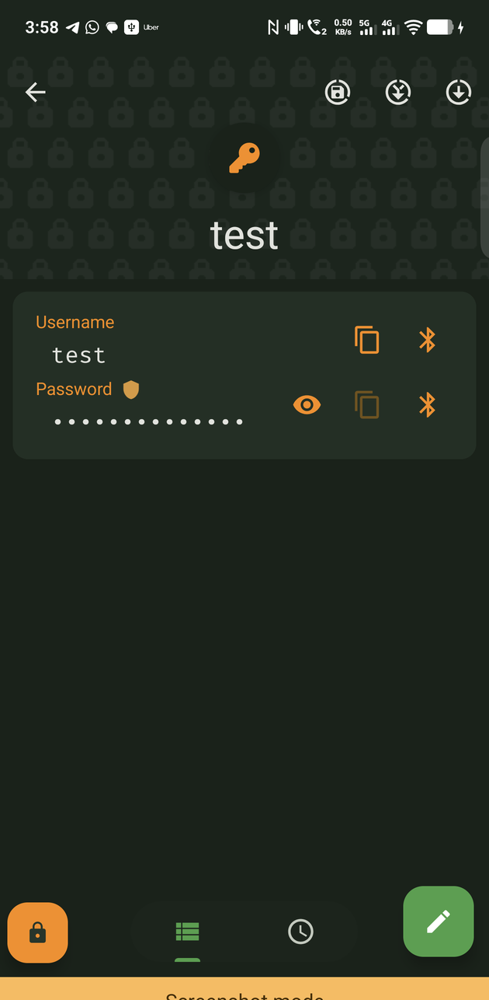
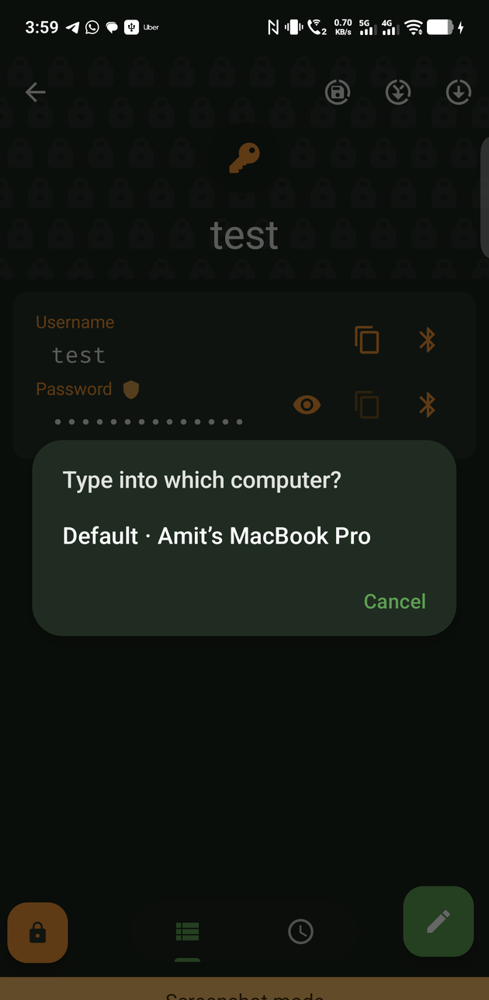
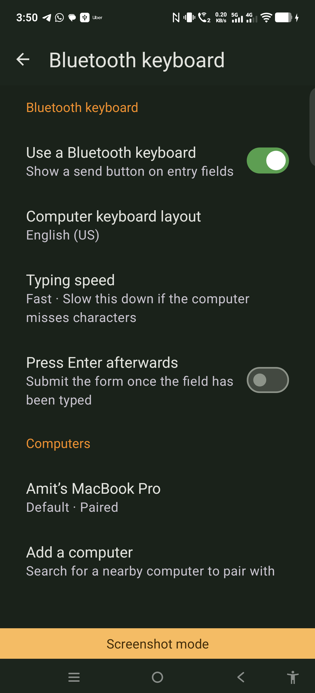

# KeePassDX-BT — Bluetooth Keyboard Auto-Type

**Current version: 4.5.2-bt1** &nbsp;·&nbsp; based on [KeePassDX 4.5.2](https://github.com/Kunzisoft/KeePassDX/releases/tag/4.5.2)
&nbsp;·&nbsp; [**Download the APK**](https://github.com/amitjaju82/KeePassDX-bluetooth-keyboard/releases/latest)

A fork of [KeePassDX](https://github.com/Kunzisoft/KeePassDX) that lets your phone **type your
credentials into a computer as a Bluetooth keyboard** — with **no dongle**, and **nothing
installed on the computer**.

Open an entry, tap the send button on any field, pick the computer, and it is typed.

> ⚠️ **Unaudited personal build.** Written by one person and tested on one phone against one
> Mac. It handles your passwords — judge accordingly, and prefer building from source if you
> can.
>
> The published APK is signed with this fork's own release key:
> `SHA-256: 8a6bb009e6e20eb9bb507433163449164e13136eebd5259860ce2d32896bc718`
> Check it before installing with `apksigner verify --print-certs <apk>`. Every future release
> uses this same key — if it ever differs, do not install.

> **Not affiliated with Kunzisoft.** This is a community fork. Please do not report issues with
> it to the upstream KeePassDX project.

Installs as `com.kunzisoft.keepass.bt`, **alongside** upstream KeePassDX rather than replacing
it. Your `.kdbx` file is untouched; app settings are not shared with an existing install.

| Entry fields | Pick the computer | Settings |
|---|---|---|
|  |  |  |
| A send button next to copy, on every field | Asked every time, so a credential never goes to the wrong machine | Layout, typing speed, and the computers you have added |

## Versioning

`<upstream version>-bt<fork release>` — so `4.5.2-bt1` is the first fork release on top of
KeePassDX 4.5.2. The version code keeps upstream's numbering with the fork release in the last
digits, so it stays ordered against upstream and leaves room for rebases onto later releases.

| Version | Based on | Notes |
|---|---|---|
| 4.5.2-bt1 | KeePassDX 4.5.2 | First release: Bluetooth keyboard auto-type, plus QR scanning for one-time passwords |

## Why this exists

Nobody in the KeePass ecosystem had shipped this. It is an open request on
[keepass2android#607](https://github.com/PhilippC/keepass2android/issues/607) (since 2018) and
[keepassxc#4952](https://github.com/keepassxreboot/keepassxc/issues/4952), and
[awesome-keepass](https://github.com/lgg/awesome-keepass) lists no wireless auto-type entry at
all.

The pieces existed separately:

| Project | Types over Bluetooth without a dongle | Reads `.kdbx` |
|---|:---:|:---:|
| [Authorizer](https://github.com/tejado/Authorizer) | yes | no — Password Safe `.psafe3` only |
| [KeePassDX](https://github.com/Kunzisoft/KeePassDX) | no | yes |
| [KeePassDX-kb](https://github.com/larrylart/KeePassDX-kb) | no — needs an ESP32-S3 dongle | yes |
| **this fork** | **yes** | **yes** |

## How it works

Android has supported the Bluetooth **HID Device** role since 9 (API 28), which lets an app
present the phone to another machine as a real input device. This fork registers an SDP record
describing a boot-protocol keyboard, converts the field value to HID scancodes for your
computer's keyboard layout, and sends them over the interrupt channel.

To the computer it is simply a Bluetooth keyboard. Windows, macOS and Linux need no driver,
no agent and no configuration beyond the usual Bluetooth pairing.

```
entry field ──▶ scancodes for the chosen layout ──▶ HID reports ──▶ computer
                                                     (paced, retried)
```

## Features

- **Send button on every field** — username, password, URL, custom fields and TOTP
- **Pick the target computer at send time**, so a phone paired with several machines never
  types a credential into the wrong one
- **Connect → type → disconnect.** The link is not held open between sends; the phone does not
  sit there advertising itself as a keyboard
- **8 host keyboard layouts** — `en_US`, `en_GB`, `de_DE`, `AppleMac_de_DE`, `de_CH`, `fr_CH`,
  `fr_FR`, `neo`
- **Optional Enter afterwards**, to submit the form
- **Adjustable typing speed**, for a computer that drops keystrokes at the default rate
- **Locks with the database.** Lock, timeout or screen-off tears down the link, unregisters the
  keyboard and zeroes the pending keystrokes
- **Nothing is half-typed.** If the selected layout cannot produce a character, the send is
  refused with a count rather than typing a partial password
- Everything else in KeePassDX — clipboard, Magikeyboard, Autofill — is **untouched**

### Also added: QR scanning for one-time passwords

A **Scan QR code** button in the OTP setup dialog, so a two-factor QR can be captured without
leaving the app.

The camera is treated as strictly optional. The permission is requested **only when you tap
Scan** — never at install or launch — and declining it leaves the rest of the dialog working.
The app also still accepts `otpauth://` URIs handed over by any external scanner, exactly as
upstream KeePassDX does, so scanning in-app is a convenience rather than the only route.

It uses [ZXing](https://github.com/journeyapps/zxing-android-embedded) (Apache-2.0, pure Java)
rather than Google's ML Kit, which is a proprietary binary and would disqualify the `libre`
flavour from F-Droid. The scanner is configured not to save a barcode image, and neither a
scanned URI nor a failed scan is logged — an unrecognised QR may still be a secret.

## Documentation for everything else

This README covers the Bluetooth keyboard feature only. Everything else — opening and syncing
database files, Magikeyboard, Autofill, OTP, hardware keys — behaves exactly as upstream, and
the [KeePassDX wiki](https://github.com/Kunzisoft/KeePassDX/wiki) is the reference for it. In
particular, [File Manager and Sync](https://github.com/Kunzisoft/KeePassDX/wiki/File-Manager-and-Sync)
explains how database files are opened and kept in sync.

## Requirements

- Android **9 (API 28)** or newer
- A phone whose build actually ships the Bluetooth HID Device profile. Most do, but some
  manufacturers omit it. Check with:
  ```
  adb shell getprop bluetooth.profile.hid.device.enabled
  ```
  The Bluetooth keyboard screen also reports when the profile is unavailable.

## Usage

1. **Settings → Form filling → Bluetooth keyboard**
2. Turn on **Use a Bluetooth keyboard**
3. Set **Computer keyboard layout** to match the *computer's* layout, not the phone's
4. **Add a computer** and pair. Pair from here rather than from Android's Bluetooth settings —
   the pairing has to happen in the keyboard role, and only this screen records the computer as
   a keyboard host
5. Open an entry and tap the send button on any field

If the computer does not offer to pair, remove the phone from its Bluetooth list and tap
**Add a computer** again.

### Managing your computers

**Computers** lists only the machines you have deliberately added — not every paired Bluetooth
device. Headphones, watches and speakers are never valid targets, and a long list of them at
send time is the quickest way to type a password into the wrong thing. Paired-but-unchosen
devices appear only while you are adding one.

Tapping a computer offers:

| | |
|---|---|
| **Connect now** | Bring the link up without sending anything, useful when first pairing |
| **Use this computer by default** | Offered first in the send picker, and marked *Default* |
| **Remove from my computers** | Drops it from the send list but leaves the Bluetooth pairing alone, so you can still use the device for other things |
| **Forget this computer** | Removes it from the list *and* unpairs it |

The first computer you add becomes the default automatically.

## Security notes

- Keystrokes are held as a `CharArray`/`ByteArray` and zeroed after transmission, never
  materialised as an immutable `String`
- The pending payload lives in-process and is never placed in an `Intent` extra, which would
  serialise a credential into a `Parcel` across a Binder
- A send only ever transmits to the computer that request selected; another host attaching
  mid-send is ignored
- Passwords, scancodes and device identifiers are never logged
- On an OTP field the generated token is typed, not the `otpauth://` URI that contains the
  shared secret

Bluetooth HID itself is only as private as the link: pairing is encrypted, but a keyboard is a
keyboard. Do not pair with a machine you do not trust.

## Credits and licensing

This fork is GPL-3.0, like KeePassDX.

- **[KeePassDX](https://github.com/Kunzisoft/KeePassDX)** © Jeremy Jamet / Kunzisoft — GPL-3.0.
  The password manager this is built on.
- **[Authorizer](https://github.com/tejado/Authorizer)** © Tjado Mäcke — GPL-3.0. The Bluetooth
  HID transport and all eight keyboard layout tables are ported from it.
- **Google WearMouse sample** © 2018 Google LLC — Apache-2.0. Seven files in
  `net/tjado/bluetooth/` derive from it and keep their original headers.
- **[amitjaju82/Authorizer @ `bluetooth-hid-autotype-fixes`](https://github.com/amitjaju82/Authorizer/tree/bluetooth-hid-autotype-fixes)**
  — the report pacing, retry and stuck-key fix described below.

Ported code keeps its original package (`net.tjado.*`) and licence headers, so its provenance
stays auditable and upstream KeePassDX rebases do not touch it.

### The stuck-key fix

Sending a password of roughly 14 characters or more used to leave the last key logically
pressed on the computer, which then auto-repeated it.

`BluetoothHidDevice.sendReport()` is not a queued API. When the L2CAP interrupt channel is
congested the stack discards the report and returns `false`, with no retransmission and no
completion callback — and that return value was being discarded. A 14-character password is 28
reports fired within microseconds, which is where the burst starts overrunning the channel's
buffer quota. When the discarded report is a key-up, the computer keeps the key held.

The fix, in `HidKeyboardReportSequence` and `HidReportTransmitter` (both free of Android
dependencies so the rules are unit-testable on the JVM):

- every key-down is followed by an all-keys-up report, and the sequence always terminates in
  one, which releases modifiers too
- reports are paced at 12 ms, derived from the keyboard QoS record the app itself advertises
  (800 byte/s over a 9-byte bucket, and a report is 9 bytes on the wire — 11.25 ms per report)
- the `sendReport()` result is honoured and refused reports are retried, with a larger budget
  for key-up reports, since a lost release is the failure that causes the stuck key
- a final all-keys-up plus a defensive repeat are sent even when the sequence is aborted

22 JVM unit tests cover 5, 13, 14, 20 and 50-character sequences, repeated characters, case
transitions, symbols, shift-heavy strings, congestion and retry, and buffer isolation. Every
case asserts the sequence ends in an explicit all-keys-up state.

## Building

Standard KeePassDX build, plus the NDK for the native crypto module:

- JDK 17
- Android SDK platform 36, build-tools 36
- **NDK 25.2.9519653** and CMake 3.22.1 (the `:crypto` module builds `aes` and `argon2` for
  four ABIs; the build fails without it even though nothing here is native)

```bash
./gradlew :app:assembleLibreDebug
./gradlew :app:testLibreDebugUnitTest --tests '*HidKeyboardTransmissionTest*'
```

The application ID is `com.kunzisoft.keepass.bt`, deliberately distinct from upstream so this
installs alongside KeePassDX and can never be mistaken for an update to it.
